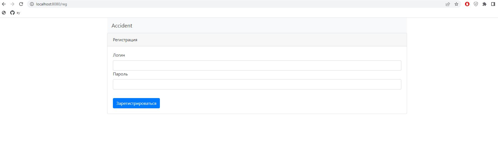
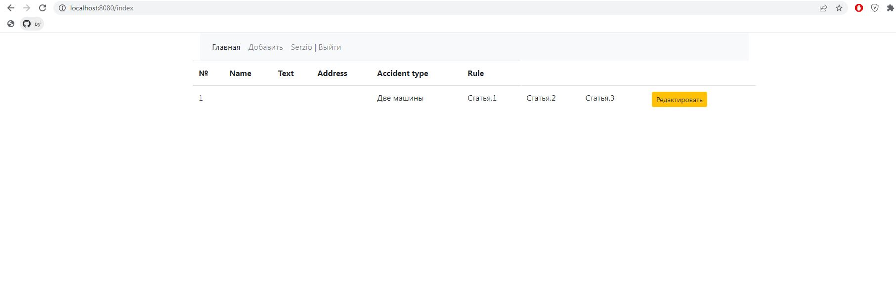
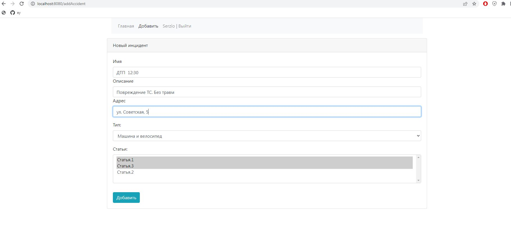
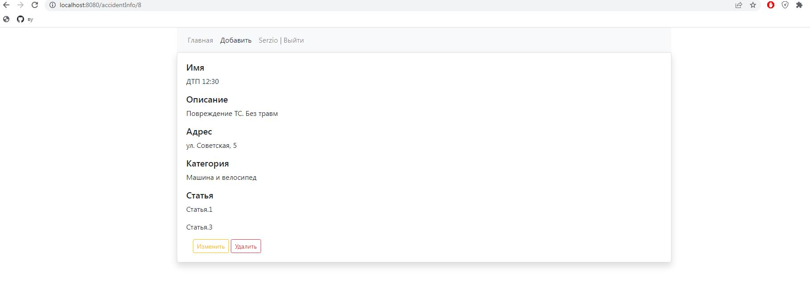

# job4j_car_accident

## Description
This project is the car accident message board;

### Used technologies:
1. Spring Web
2. Spring Security
3. Hibernate
4. PostgreSQL
5. Thymeleaf

### Functionality:
Login page

Main page

Adding new post

Edit post
